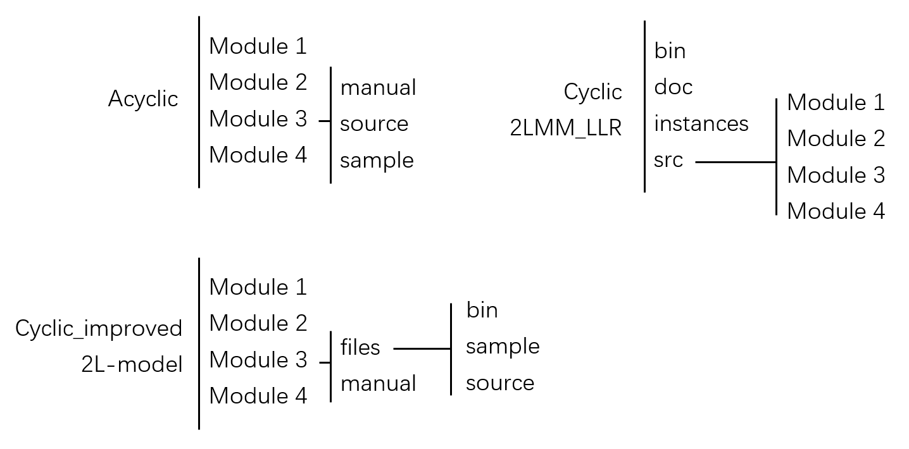
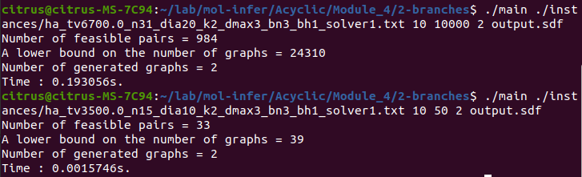
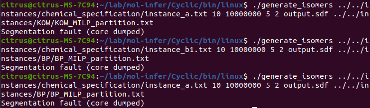

# Overall Issues

1. **Acyclic** claims documentation should be written in Markdown. But existing documentation (except the  Acyclic Module 1) are using Latex. Should we transfer to Markdown?

2. Each part have a different file structure.

   

3. Some underscores ("_") would disappear when copying and pasting commands into the terminal.

4. CBC solver cannot find feasible solution for MILPs. Currently not tested with CPLEX (I don't have a software license). Marked as Not tested.

# Acyclic

Inconsistent manual filename. (`Readme.md`, `Manual_Module_2_en.pdf`, `Manual_MILP_BH_en.pdf`, `Module4_manual_en.pdf`)

### Module 1 Pass

None

### Module 2 Fail

`Readme_ja.md` is empty.

Hyperlinks in `Readme.md` are broken.

Missing sample input files `ha_fv4_plus.csv` and `ha_target_data.csv`.

### Module 3 Fail

The second half of `Manual_MILP_BH_en.pdf` is written in Japanese.

Hyperlink in `REDME.md` is broken.

No Japanese documentation.

Module 2 failed, thus no usable `rt_desc.csv`, `rt_weights.txt` and `rt_biases.txt.`

### Module 4 Pass

Folder and file names do not match the manual (It seems lots of folders and files are modified and the manuals have not been updated).

Sample input file `ha_tv3500_n15_dia10_dmax3_k2_bn2_bh1.txt` not present in `instances` folder.

The required argument "*3. an integer of vector size bound per iteration*" is not given in the manual.

Tested with the following commands:

# Cyclic

Documentation for all 4 modules are in a single file (`Manual_Cyclic_en.pdf`). Should we separate it into different files?

`.DS_Store` files should be removed. (Use gitignore).

### Module 1 Pass

None

### Module 2 Pass

In manual page 12:

`python predict_values.py output_weights.txt output_biases.txt \
instances/BP/BP_desc.csv predicted.txt`

should be 

`python predict_values.py output_weights.txt output_biases.txt \
../instances/BP/BP_desc.csv predicted.txt`

(Adding a `../` to the front of `instances/BP/BP_desc.csv`)

### Module 3 Not tested

Solver type is hard coded in `infer_cylic_graphs_ec_id.py`, line 61.

### Module 4 Fail

No concrete example for `generate_isomers` (no idea how to fill in command arguments).

Got Segmentation fault when executing generate_isomers (probably due to incorrect arguments).

# Cyclic_improved

### Module 1 Pass

None

### Module 2 Pass

None

### Module 3 Not tested

In `infer_cylic_graphs_ec_id.py`, solver type in arguments is ignored (line 26, 27) and hard coded (line 59). (Solver type is provided in command arguments.)

### Module 4 Pass

Incorrect filename in English manual (while it's correct in Japanese manual). Claimed `generate_isomers.cpp`, but it should be `main.cpp` (pages 6 & 7).

# 2L-model

### Module 1 Pass

No English documentation.

### Module 2 Pass

No English documentation.

### Module 3 Not tested

No Japanese documentation.

### Module 4 Pass

`Manual_Module_4_2L-model_en.pdf` has no menu (it's a blank page).

Unnecessary `\` in English manual (page 5, section 3.2.1, Compiling the program, `g++ -o generate_isomers generate\_isomers.cpp -O3 -std=c++11`).

# 2LMM-LLR

All references In the manual are corrupted. (displayed as "?" or "??").

Lots of `src` are misspelled as a `scr`: page 3, 25, 26.

### Module 1 Pass

Missing Makefile.

Typo:

1. `src/Module1/fringe/RrootedGraph.hpp`. Should be `RootedGraph.hpp`

2. In manual page 3, `./FV_2LMM_V018 ../scr/Module1/sample_instance/sample1.sdf output.csv`. `scr` should be `src`.

### Module 2 Pass

None

### Module 3 Not tested

In manual page 16, last line: `python infer_2LMM_L.py ../src/Module 3/sample instance/Hc 1900 1920`, `infer_2LMM_L.py` should be `infer_2LMM_LLR.py`

### Module 4 Pass

None
