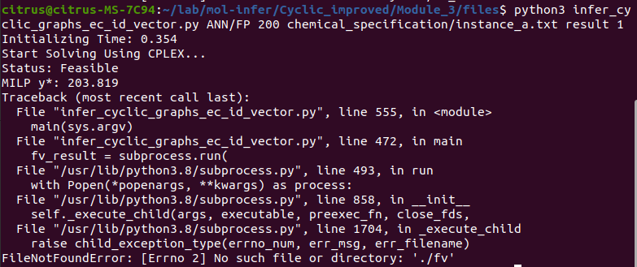
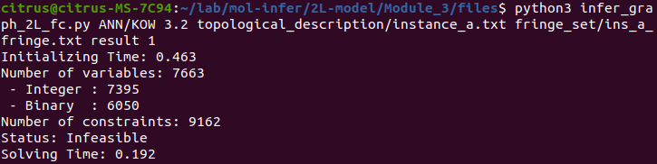

# Executable / code issues

### Acyclic

**Module 2 - Fail**

Missing sample input files `ha_fv4_plus.csv` and `ha_target_data.csv`.

**Module 3 - Fail**

Module 2 failed, thus no usable `rt_desc.csv`, `rt_weights.txt` and `rt_biases.txt.`

**Module 4 - Pass**

Sample input file `ha_tv3500_n15_dia10_dmax3_k2_bn2_bh1.txt` not present in `instances` folder.

The required argument "*3. an integer of vector size bound per iteration*" is not given in the manual.

Tested with the following commands:

### Cyclic

**Pass**

### Cyclic_improved

**Module 3 - Fail**

Seems fail to write the result to file.

### 2L-model

**Module 3 - Fail**

Example is infeasible.

### 2LMM-LLR

**Pass**

# Documentation / file issues

### Overall

**Acyclic** claims documentation should be written in Markdown. But existing documentation (except the  Acyclic Module 1) are using Latex. Should we transfer to Markdown?

Each part have a different file structure.

Some underscores ("_") would disappear when copying and pasting commands into the terminal.

### Acyclic

Inconsistent manual filename. (`Readme.md`, `Manual_Module_2_en.pdf`, `Manual_MILP_BH_en.pdf`, `Module4_manual_en.pdf`)

**Module 2 -** `Readme_ja.md` is empty. | Hyperlinks in `Readme.md` are broken.

**Module 3 -** The second half of `Manual_MILP_BH_en.pdf` is written in Japanese. | Hyperlink in `REDME.md` is broken. | No Japanese documentation.

**Module 4 -** Folder and file names do not match the manual (It seems lots of folders and files are modified and the manuals have not been updated).

### Cyclic

Documentation for all 4 modules are in a single file (`Manual_Cyclic_en.pdf`). Should we separate it into different files?

`.DS_Store` files should be removed. (Use gitignore).

In manual page 12: Should add a `../` to the front of `instances/BP/BP_desc.csv` in example command.

### Cyclic_improved

**Module 3 -** In `infer_cylic_graphs_ec_id.py`, solver type in arguments is ignored (line 26, 27) and hard coded (line 59). (Solver type is provided in command arguments.)

**Module 4 -** Incorrect filename in English manual (while it's correct in Japanese manual). Claimed `generate_isomers.cpp`, but it should be `main.cpp` (pages 6 & 7).

### 2L-model

**Module 1 -** No English documentation.

**Module 2 -** No English documentation.

**Module 3 -** No Japanese documentation.

**Module 4 -** `Manual_Module_4_2L-model_en.pdf` has no menu (it's a blank page). | Unnecessary `\` in English manual (page 5, section 3.2.1, Compiling the program, `g++ -o generate_isomers generate\_isomers.cpp -O3 -std=c++11`).

### 2LMM-LLR

**Module 1 -** Missing Makefile.
